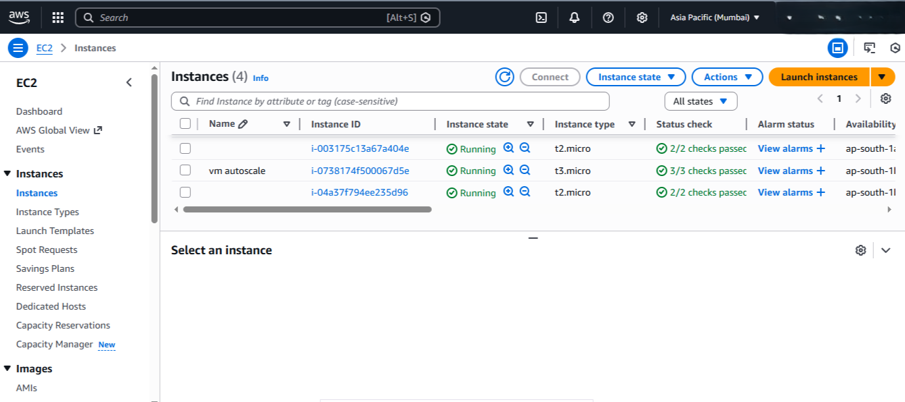
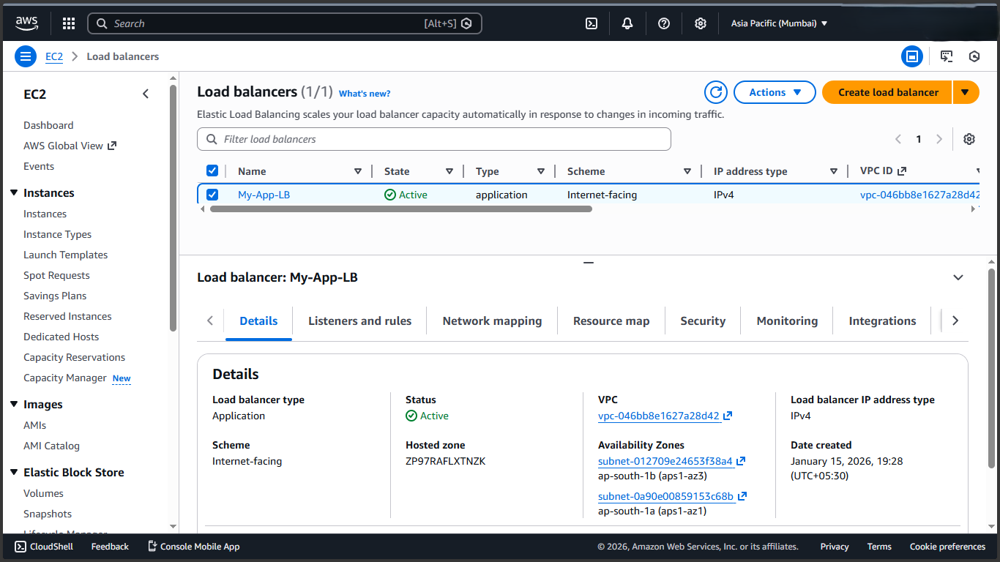
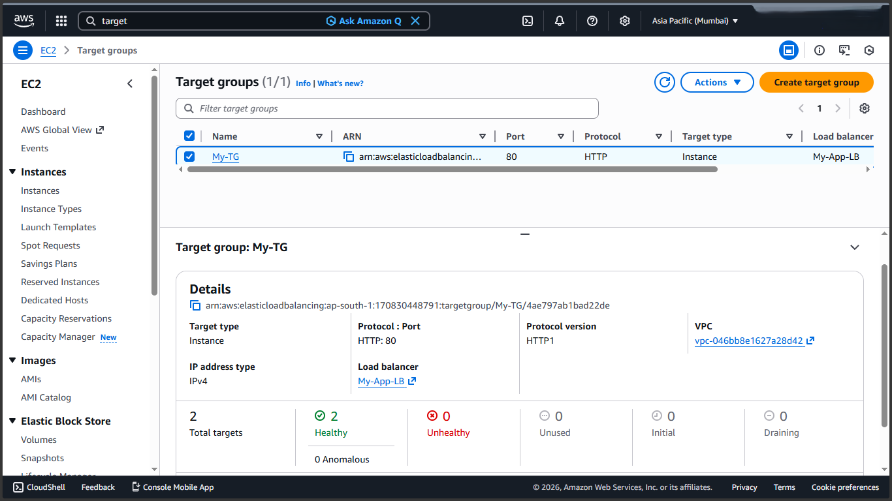
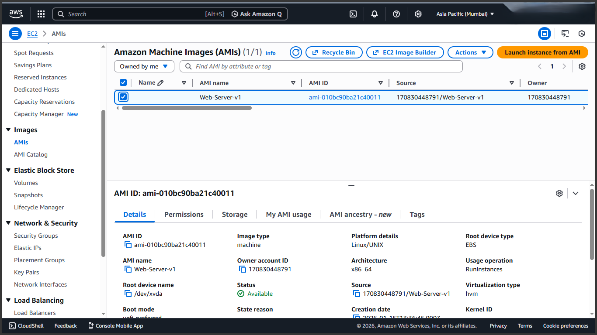
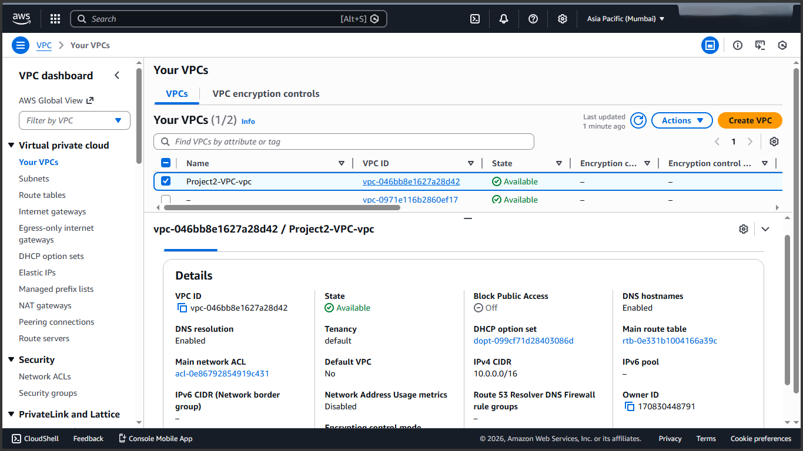
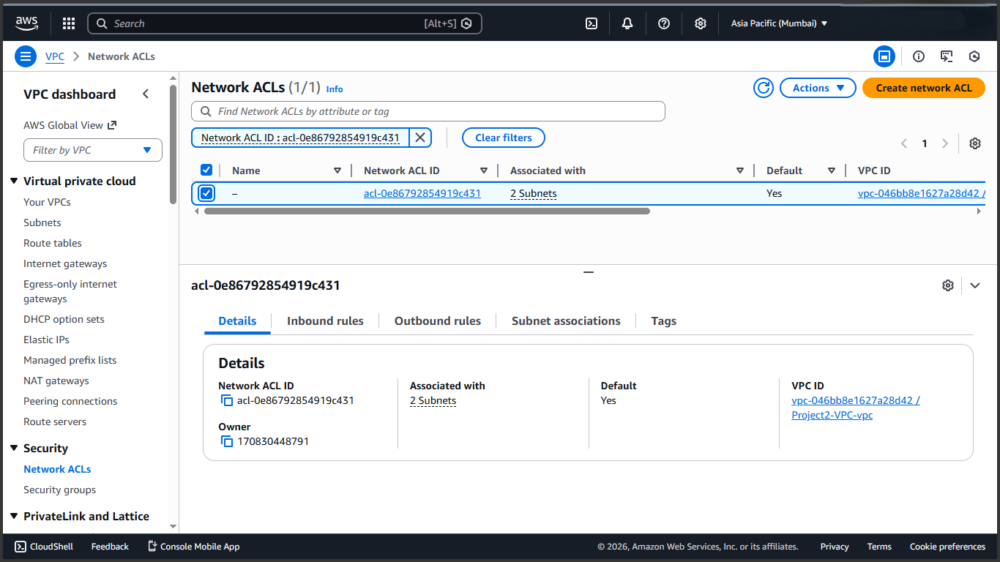

# 🚀 DevOps Auto-Scaling Flask Application

This project demonstrates a complete **End-to-End DevOps Lifecycle** for deploying a High-Availability Python Flask application on AWS. It leverages **Docker** for containerization, **GitHub Actions** for CI/CD, and **AWS Auto Scaling** to ensure fault tolerance and scalability.

## 🏗️ Architecture & Workflow

The infrastructure is designed to be self-healing and scalable, capable of handling traffic spikes automatically.

1.  **Code Commit:** Developers push code to the GitHub repository.
2.  **CI/CD Pipeline:** GitHub Actions automatically builds the Docker image and pushes it to **DockerHub**.
3.  **Deployment:** The pipeline triggers a deployment to AWS EC2 instances.
4.  **Auto Scaling:** The application runs inside an **Auto Scaling Group (ASG)** behind an **Application Load Balancer (ALB)**.
    * **Scale Out:** Adds instances when CPU > 50%.
    * **Scale In:** Removes instances when load decreases.

---

## 📸 Implementation Screenshots

### 1. Final Application Output
The Dockerized Flask application running successfully on AWS.


### 2. AWS Auto Scaling in Action
Three instances running automatically to handle the load (VM Autoscale).



### 3. Application Load Balancer
The internet-facing Load Balancer distributing traffic to healthy instances.



### 4. Target Groups & Health Checks
Healthy targets registered on Port 80.



### 5. Launch Template Configuration
The blueprint for our instances, defining the AMI and Instance Type.


### 6. Custom AMI (Amazon Machine Image)
The pre-configured image used to speed up instance launching.



### 7. VPC & Networking Setup
Isolated Virtual Private Cloud (VPC) for secure networking.




---

## 📂 Project Structure

```bash
├── .github/workflows/   # CI/CD Pipeline (YAML)
├── app.py               # Main Flask Application
├── Dockerfile           # Docker image configuration
└── README.md            # Project Documentation

````
---

### 🛠️ Tech Stack
Cloud Provider: AWS (EC2, VPC, ALB, Auto Scaling, AMI)

Containerization: Docker & DockerHub

Orchestration: GitHub Actions (CI/CD)

Language: Python (Flask)

IaC/Config: Launch Templates, User Data

---

### ⚙️ CI/CD Pipeline Configuration

The GitHub Actions workflow performs the following steps:

Checkout Code: Pulls the latest code.

Build Docker Image: Uses the Dockerfile.

Login to DockerHub: Authenticates using Repository Secrets.

Push to Registry: Uploads the image to DockerHub.

Deploy: Updates the AWS infrastructure.

Repository Secrets Required

To replicate this pipeline, add the following secrets in Settings > Secrets and variables > Actions:

DOCKER_USERNAME: Your DockerHub username.

DOCKER_PASSWORD: Your DockerHub access token/password.

---

### 🚀 How to Run

Clone the Repo:

```bash
git clone [https://github.com/BKY1601/Devops-autoscale.git](https://github.com/BKY1601/Devops-autoscale.git)

```
Run Locally (Docker):
```bash
docker build -t my-flask-app .
docker run -p 80:5000 my-flask-app
```
---
Access: 

Open http://localhost:80 (or the ALB DNS name for AWS).

---

## 👨‍💻 Author

**Bipin Yadav**  
📧 bipinyadav919@gmail.com  
🔗 [LinkedIn](https://linkedin.com/in/bipin-yadav-jan16)  
🔗 [GitHub](https://github.com/BKY1601)                                           
